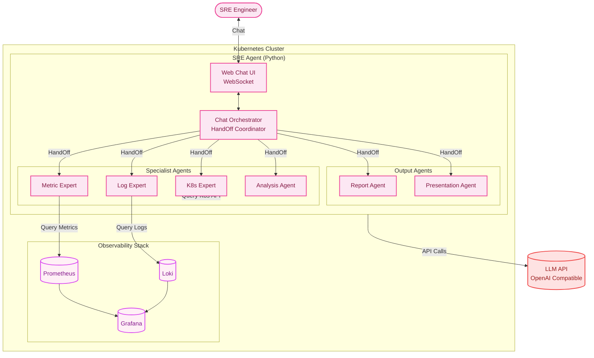
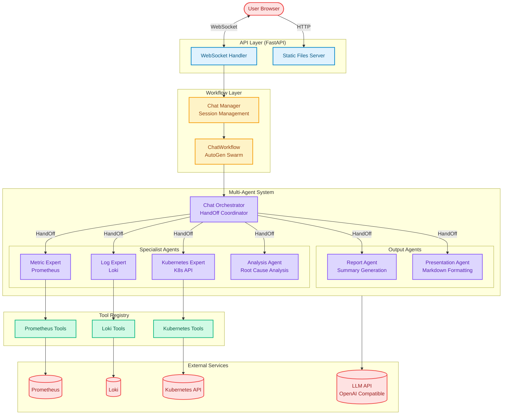
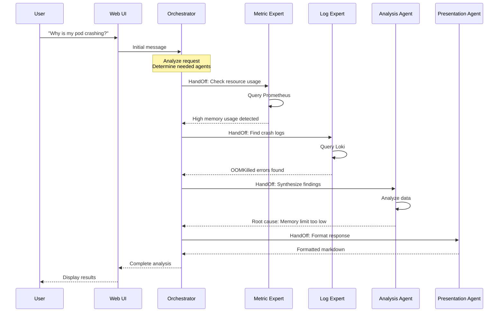
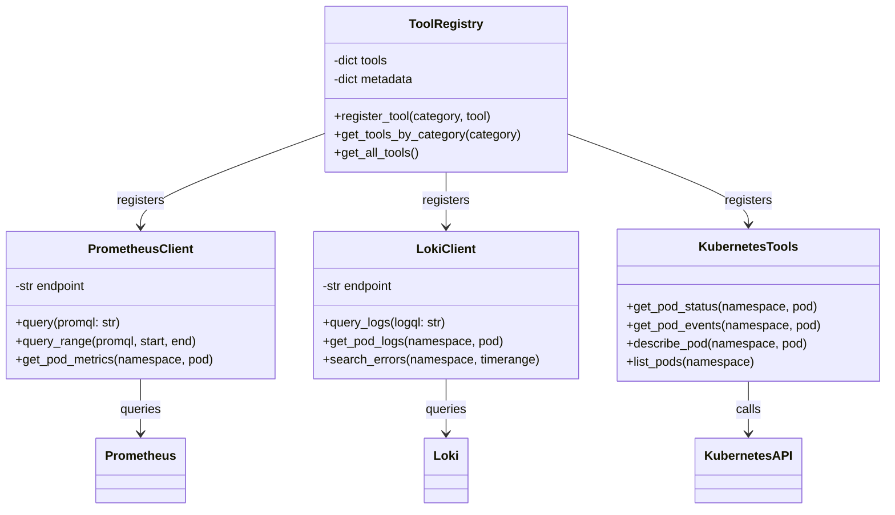
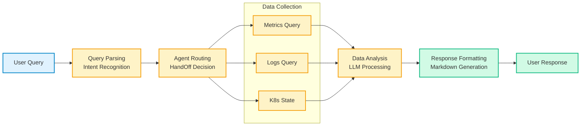
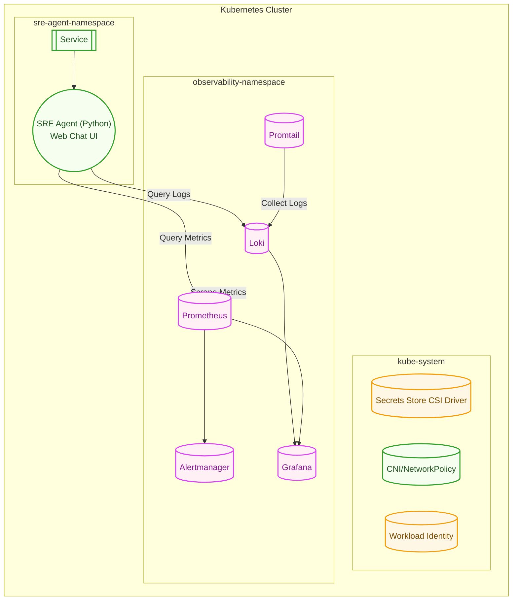

# SRE Agent for Kubernetes

**AI 기반 대화형 Kubernetes 운영 봇**

Kubernetes 클러스터 운영 중 발생하는 문제를 실시간 채팅으로 분석하고 해결 방안을 제시하는 AI SRE 봇입니다.

자연어로 질문하면 여러 전문 에이전트(메트릭, 로그, 분석)가 협력하여 Prometheus 메트릭과 Loki 로그를 조회하고, 근본 원인을 파악한 후 해결 방법을 추천해줍니다. AutoGen Swarm 패턴을 활용한 대화형 워크플로우로, 마치 전문 SRE 엔지니어와 대화하듯이 클러스터## 3) Dev Environment (개발 환경 설정)

### 필수 도구

*   **Docker**, **kubectl**(1.29+), **kind** (또는 k3d/minikube)
*   **Python 3.11+** (Agent)
*   **Go 1.22+** (Operator, 미구현)
*   (권장) **make**, **k9s**, **stern**, **jq**
*   **VS Code** + 확장(아래 "코딩 컨벤션 & VS Code 자동화" 참고)


## 4) Local Development (컴포넌트별)결할 수 있습니다.

---

> *   구성요소: **Operator (Go, 🚧 미구현)** + **SRE Agent (Python, 웹 채팅 UI 포함)**
> *   목적: 실시간 채팅 기반으로 K8s 문제 진단 → **Multi-Agent 협업** → **LLM(OpenAI 호환 API)** 기반 분석/추천 제공


## 1) Architecture (개념)

High Level Design




## 2) Software Design

SRE Agent의 소프트웨어 아키텍처 및 컴포넌트 구조

### 2.1) 전체 아키텍처



### 2.2) Agent 협업 패턴 (AutoGen Swarm)



### 2.3) 도구 계층 구조



### 2.4) 데이터 흐름




## 3) Dev Environment (개발 환경 설정)

### 필수 도구

*   **Docker**, **kubectl**(1.29+), **kind** (또는 k3d/minikube)
*   **Go 1.22+** (Operator)
*   **Python 3.11+** (Agent)
*   (권장) **make**, **k9s**, **stern**, **jq**
*   **VS Code** + 확장(아래 “코딩 컨벤션 & VS Code 자동화” 참고)


## 3) Local Development (컴포넌트별)

### Operator (Go) - 🚧 미구현

*   역할: **CRD Watch → Agent 연동 (향후 계획)**
*   상태: **아직 구현되지 않음**

### SRE Agent (Python) - ✅ 구현됨

*   역할: **웹 채팅 UI 제공 → 사용자 질문 접수 → Multi-Agent 협업(Orchestrator, Metric Expert, Log Expert, Analysis Agent) → Prometheus/Loki 조회 → 분석 결과 및 해결 방안 제시**
*   기술 스택: FastAPI + WebSocket, AutoGen Swarm, Prometheus/Loki 클라이언트
*   로컬 실행:
    ```bash
    cd agent
    # 환경 설정 (configs/agents.yaml 설정 필요)
    make dev  # 또는 uv run python dev.py
    # 브라우저에서 http://localhost:8000 접속하여 채팅 시작
    ```

## 5) Team Coding Conventions

> 목표: **“설치하면 바로 일관성 유지”**. 팀 합의가 필요한 규칙은 최소로 두고, VS Code 확장과 설정으로 자동화.

### 추천 VS Code 확장 (추천 리스트)

*   **Python**: `ms-python.python`, `ms-python.black-formatter`, `charliermarsh.ruff`
*   **Go**: `golang.go` (gopls/gofmt/goimports 통합), `golangci-lint` (있으면 사용)
*   **YAML/Kubernetes**: `redhat.vscode-yaml`, `ms-kubernetes-tools.vscode-kubernetes-tools`
*   **일반 품질/편의**: `esbenp.prettier-vscode`, `EditorConfig.EditorConfig`, `eamodio.gitlens`, `github.vscode-pull-request-github`, `foxundermoon.shell-format`

> **권장 파일**: `.vscode/extensions.json` 를 나중에 추가

```json
{
  "recommendations": [
    "ms-python.python",
    "ms-python.black-formatter",
    "charliermarsh.ruff",
    "golang.go",
    "redhat.vscode-yaml",
    "ms-kubernetes-tools.vscode-kubernetes-tools",
    "EditorConfig.EditorConfig",
    "eamodio.gitlens",
    "github.vscode-pull-request-github"
  ]
}
```

### VS Code 기본 설정(권장 스니펫)

> **권장 파일**: `.vscode/settings.json` 를 나중에 추가

```json
{
  "files.trimTrailingWhitespace": true,
  "files.insertFinalNewline": true,
  "editor.formatOnSave": true,
  "editor.codeActionsOnSave": {
    "source.fixAll": "always",
    "source.organizeImports": "always"
  },

  // Python
  "python.defaultInterpreterPath": "python",
  "python.analysis.typeCheckingMode": "basic",
  "python.formatting.provider": "black",
  "[python]": {
    "editor.defaultFormatter": "ms-python.black-formatter"
  },
  "ruff.lint.args": ["--select=E,F,I,B"],
  "ruff.fixAll": true,

  // Go
  "go.useLanguageServer": true,
  "go.formatTool": "gofmt",
  "go.toolsManagement.autoUpdate": true,
  "go.lintTool": "golangci-lint",

  // YAML & K8s
  "yaml.format.enable": true,
  "yaml.validate": true,
  "yaml.schemas": {
    "kubernetes": [
      "deploy/**/*.yaml",
      "deploy/**/crds/*.yaml"
    ]
  }
}
```

### 공통 코딩 규칙(요약)

*   **커밋 메시지**: Conventional Commits (`feat:`, `fix:`, `docs:`, `refactor:`, `chore:`, `ci:`)
*   **로그 키 일관성**: `component`, `correlationId`, `namespace(ns)`, `resource(name)`
*   **예외/에러**: 원인 보존(Go: `%w`로 래핑), 사용자 메시지와 내부 스택 분리
*   **문서 우선**: 기능/행동 변경 시 **README 해당 섹션** 동반 갱신
*   **시크릿/키**: 커밋 금지. `.env`/로컬 값은 `.gitignore` 유지


## 6) Git Workflow (가이드)

**브랜치 모델 (Trunk-based 권장)**

*   `main`: 보호 브랜치(항상 배포 가능 상태 유지)
*   작업 브랜치: `feat/<short-desc>`, `fix/<short-desc>`
*   필요 시 릴리스 브랜치: `release/x.y`

**PR 원칙**

*   **스몰 PR**(리뷰 ≤ \~300라인) & 1 목적
*   PR 제목: Conventional Commits 활용
    *   예: `feat(operator): wire trigger-to-agent decision path`
*   체크리스트(권장):
    *   변경 요약 / 테스트 범위 / 리스크 / **README 갱신 여부** / 시크릿 미포함
*   보호 규칙: `main`에 직접 푸시 금지, **CI(린트/테스트) 통과 필수**

**버전/릴리스**

*   **SemVer**: `v0.x`
*   태그: `v0.1.0`부터 시작
*   GitHub Actions/Release 자동화는 추후 도입

## 7) 환경 변수 & 설정

TBD...


## 8) Repo Layout

    sre-agent/
    ├─ operator/   # 🚧 미구현 - 독립 Go 모듈 (향후 추가 예정)
    ├─ agent/      # 독립 Python 모듈
    └─ shared/     # 공통 스펙/문서/샘플


## 9) Infrastructure

Kubernetes 클러스터 내부 구성


