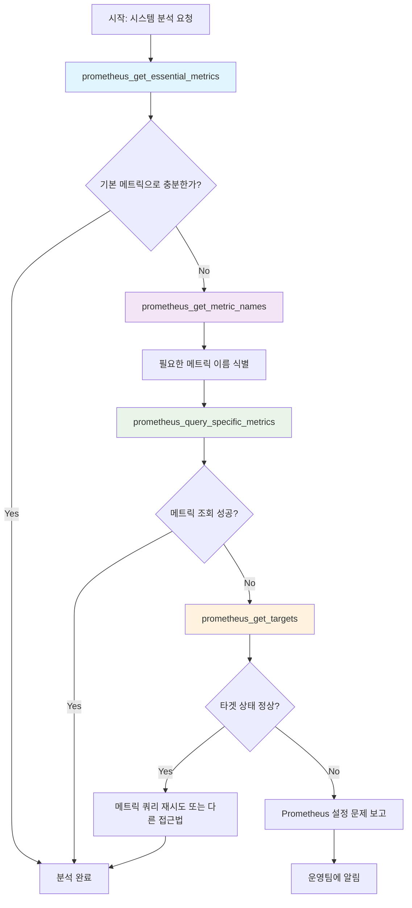

# Prometheus Tools Workflow Documentation

본 문서는 AI SRE Agent에서 Prometheus 모니터링 데이터를 효율적으로 수집하고 분석하기 위한 도구들의 워크플로우를 설명합니다.

## 도구 워크플로우 개요

Prometheus Tools는 4단계의 체계적인 접근 방식을 통해 시스템 모니터링과 문제 진단을 수행합니다:

1. **기본 시스템 메트릭 수집** (`prometheus_get_essential_metrics`)
2. **메트릭 이름 탐색** (`prometheus_get_metric_names`) 
3. **상세 메트릭 조회** (`prometheus_query_specific_metrics`)
4. **서비스 상태 확인** (`prometheus_get_targets`)

### 단계별 워크플로우 설명

#### 1단계: 기본 시스템 메트릭 수집
`prometheus_get_essential_metrics`를 사용하여 시스템의 핵심 메트릭(CPU, 메모리, 디스크 사용률 등)을 먼저 수집합니다. 이를 통해 시스템의 전반적인 상태를 빠르게 파악할 수 있습니다.

#### 2단계: 메트릭 이름 탐색
특정 문제를 심층 분석해야 하는 경우, `prometheus_get_metric_names`를 호출하여 사용 가능한 메트릭 이름 목록을 조회합니다. 이는 네임스페이스나 포드별로 필터링이 가능합니다.

#### 3단계: 상세 메트릭 조회
2단계에서 찾은 메트릭 이름들을 바탕으로 `prometheus_query_specific_metrics`를 사용하여 상세한 시계열 데이터를 수집합니다. 이 단계에서는 시간 범위, 해상도 등을 세밀하게 조정할 수 있습니다.

#### 4단계: 서비스 상태 확인
메트릭 조회에 문제가 있거나 응답이 비정상적인 경우, `prometheus_get_targets`를 호출하여 Prometheus가 정상적으로 타겟을 스크래핑하고 있는지 확인합니다.

## 워크플로우 다이어그램



## API 호출 샘플 데이터셋

### 1. prometheus_get_essential_metrics

**기본 호출**
```json
{
  "namespace": null,
  "pod_name": null,
  "start_time": null,
  "end_time": null,
  "step": "1m",
  "prometheus_url": null
}
```

**네임스페이스 필터링**
```json
{
  "namespace": "production",
  "pod_name": null,
  "start_time": null,
  "end_time": null,
  "step": "1m",
  "prometheus_url": null
}
```

**특정 포드 분석**
```json
{
  "namespace": "production",
  "pod_name": "web-server-*",
  "start_time": "2024-01-01T10:00:00Z",
  "end_time": "2024-01-01T11:00:00Z",
  "step": "5m",
  "prometheus_url": "http://prometheus.monitoring.svc.cluster.local:9090"
}
```

### 2. prometheus_get_metric_names

**전체 메트릭 조회**
```json
{
  "namespace": null,
  "pod_name": null,
  "metric_name": null,
  "limit": 1000,
  "prometheus_url": null
}
```

**네임스페이스별 메트릭 조회**
```json
{
  "namespace": "monitoring",
  "pod_name": null,
  "metric_name": null,
  "limit": 500,
  "prometheus_url": null
}
```

**패턴 매칭을 통한 메트릭 검색**
```json
{
  "namespace": "production",
  "pod_name": "nginx-*",
  "metric_name": "http_*",
  "limit": 100,
  "prometheus_url": null
}
```

### 3. prometheus_query_specific_metrics

**단일 메트릭 조회**
```json
{
  "metric_names": ["up"],
  "start_time": null,
  "end_time": null,
  "namespace": null,
  "pod_name": null,
  "limit_per_metric": 50,
  "step": "1m",
  "prometheus_url": null
}
```

**다중 메트릭 조회**
```json
{
  "metric_names": [
    "cpu_usage_seconds_total",
    "memory_usage_bytes",
    "network_receive_bytes_total"
  ],
  "start_time": "2024-01-01T09:00:00Z",
  "end_time": "2024-01-01T10:00:00Z",
  "namespace": "production",
  "pod_name": "api-server-*",
  "limit_per_metric": 100,
  "step": "30s",
  "prometheus_url": null
}
```

**고해상도 시계열 데이터**
```json
{
  "metric_names": [
    "http_request_duration_seconds",
    "http_requests_total"
  ],
  "start_time": 1704096000,
  "end_time": 1704099600,
  "namespace": "web",
  "pod_name": null,
  "limit_per_metric": 200,
  "step": "15s",
  "prometheus_url": "http://prometheus.example.com:9090"
}
```

### 4. prometheus_get_targets

**기본 타겟 조회**
```json
{
  "prometheus_url": null
}
```

**특정 Prometheus 인스턴스 조회**
```json
{
  "prometheus_url": "http://prometheus.monitoring.svc.cluster.local:9090"
}
```

## 응답 형식

모든 함수는 다음과 같은 구조의 응답을 반환합니다:

### 성공 응답
```json
{
  "status": "success",
  "query_info": {
    "total_queries": 1,
    "successful_queries": 1,
    "failed_queries": 0,
    "query_time": "2024-01-01T10:30:00Z"
  },
  "metrics": {
    "metric_name": {
      "data": [...],
      "metadata": {...}
    }
  }
}
```

### 오류 응답
```json
{
  "status": "error",
  "error": "Connection timeout to Prometheus server",
  "context": {
    "prometheus_url": "http://prometheus.example.com:9090",
    "retry_count": 3
  }
}
```

## 사용 시나리오 예제

### 시나리오 1: 시스템 성능 분석
1. `prometheus_get_essential_metrics(namespace="production")`
2. CPU 사용률이 높은 경우 → `prometheus_get_metric_names(metric_name="cpu_*")`
3. `prometheus_query_specific_metrics(metric_names=["cpu_usage_seconds_total"])`

### 시나리오 2: 네트워크 문제 진단
1. `prometheus_get_essential_metrics(pod_name="nginx-*")`
2. `prometheus_get_metric_names(metric_name="network_*")`
3. `prometheus_query_specific_metrics(metric_names=["network_receive_errors_total"])`

### 시나리오 3: 모니터링 시스템 상태 확인
1. 메트릭 조회가 실패하는 경우
2. `prometheus_get_targets()` → Prometheus 스크래핑 상태 확인
3. 필요시 Prometheus 설정 점검 또는 재시작

## 모범 사례

1. **단계적 접근**: 항상 essential metrics부터 시작하여 점진적으로 상세 분석
2. **효율적인 쿼리**: `limit_per_metric` 매개변수를 활용하여 데이터 볼륨 제어
3. **오류 처리**: 메트릭 조회 실패 시 반드시 targets 상태 확인
4. **시간 범위 최적화**: 불필요하게 긴 시간 범위의 쿼리 지양
5. **네임스페이스 활용**: 대규모 클러스터에서는 네임스페이스 필터링 필수

## 주의사항

- Prometheus 서버의 부하를 고려하여 적절한 `step`과 `limit_per_metric` 설정
- 시간 범위가 클 경우 메모리 사용량 증가 가능성
- 네트워크 지연이나 타임아웃에 대비한 재시도 로직 필요
- 메트릭 이름 패턴 매칭 시 와일드카드(`*`, `?`) 적절히 활용
